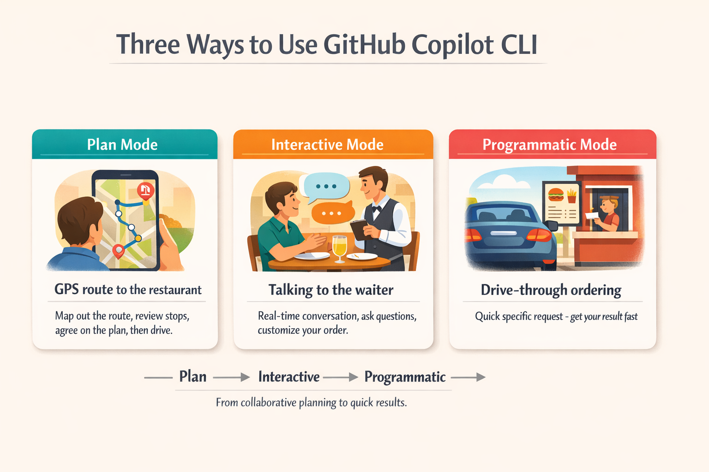
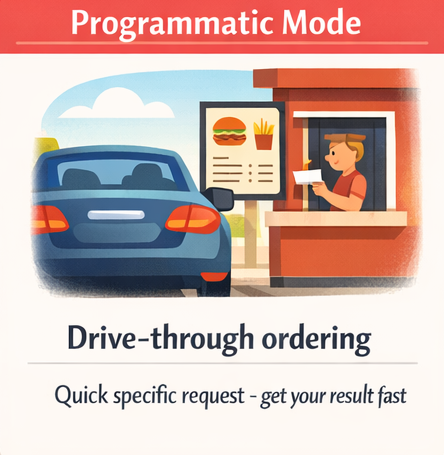

> **Watch AI find bugs instantly, explain confusing code, and generate working scripts. Then learn three different ways to use Copilot.**

This chapter is where the magic starts! You'll experience firsthand why developers describe Copilot CLI as having a senior engineer on speed dial. You'll watch AI find security bugs in seconds, get complex code explained in plain English, and generate working scripts instantly. Then you'll master the three interaction modes (Interactive, Plan, and Programmatic) so you know exactly which one to use for any task.

> ⚠️ **Prerequisites**: Make sure you've completed **[Chapter 00: Quick Start](../00-quick-start/README.md)** first. You'll need GitHub Copilot CLI installed and authenticated before running the demos below.

## Learning Objectives

By the end of this chapter, you'll be able to:

- Experience why developers call this "having a senior engineer on speed dial"
- Choose the right mode (Interactive, Plan, or Programmatic) for any task
- Use slash commands to control your sessions

> ⏱️ **Estimated Time**: ~50 minutes (20 min reading + 30 min hands-on)

---

## Getting Comfortable: Your First Prompts

Before diving into the impressive demos, let's start with some simple prompts you can try right now. **No code repository needed**! Just open a terminal and start Copilot:

```bash
copilot
```

Try these beginner-friendly prompts:

```
> Explain what a dataclass is in Python in simple terms

> Write a function that sorts a list of dictionaries by a specific key

> What's the difference between a list and a tuple in Python?

> Give me 5 best practices for writing clean Python code
```

Don't use Python? No problem! Just ask questions about your language of choice.

Notice how natural it feels. Just ask questions like you would to a colleague. When you're done exploring, type `/exit` to leave the session.

**The key insight**: GitHub Copilot CLI is conversational. You don't need special syntax to get started. Just ask questions in plain English.

## See It In Action

Now let's see why developers are calling this "having a senior engineer on speed dial."

> 📖 **Reading the Examples**: Lines starting with `>` are prompts you type inside an interactive Copilot session. Lines without a `>` prefix are shell commands you run in your terminal.

> 💡 **About Example Outputs**: The sample outputs shown throughout this course are illustrative. Because Copilot's responses vary each time, your results will differ in wording, formatting, and detail. Focus on the *type* of information returned, not the exact text.

### Demo 1: Code Review in Seconds

The course includes sample files with intentional code quality issues. Let's review one:

```bash
# Clone the course repository (if you haven't already)
git clone https://github.com/github/github-copilot-cli-for-beginners
cd github-copilot-cli-for-beginners

# Start Copilot
copilot
```

Once inside the interactive session:

```
> Review @samples/book-app-project/book_app.py for code quality issues and suggest improvements
```

> 💡 **What's the `@`?** The `@` symbol tells Copilot to read a file. You'll learn all about this in Chapter 02. For now, just copy the command exactly as shown.

---

<details>
<summary>🎬 See it in action!</summary>


*Demo output varies — your model, tools, and responses will differ from what's shown here.*

</details>

---

**The takeaway**: A professional code review in seconds. Manual review would take...well...more time than that!

---

### Demo 2: Explain Confusing Code

Ever stared at code wondering what it does? Try this in your Copilot session:

```
> Explain what @samples/book-app-project/books.py does in simple terms
```

---

<details>
<summary>🎬 See it in action!</summary>


*Demo output varies — your model, tools, and responses will differ from what's shown here.*

</details>

---

**What happens**: (your output will differ) Copilot reads the file, understands the code, and explains it in plain English.

```
This is a book collection management module using Python dataclasses.

Think of it like a digital bookshelf:
- Book is a dataclass - a simple way to store book information (title, author, year, read status)
- BookCollection manages the entire collection and handles saving/loading

Key components:

1. @dataclass decorator (line 8)
   - Automatically creates __init__, __repr__, etc.
   - Clean way to define data structures in Python

2. BookCollection class (line 16)
   - Maintains a list of Book objects
   - Handles persistence with JSON file I/O
   - load_books() reads from data.json
   - save_books() writes to data.json using asdict()

3. Book operations:
   - add_book() - creates and saves new books
   - find_book_by_title() - searches collection
   - mark_as_read() - updates read status
   - find_by_author() - filters by author name

Common pattern: Read from JSON → Work with Python objects → Write back to JSON
```

**The takeaway**: Complex code explained like a patient mentor would explain it.

---

### Demo 3: Generate Working Code

Need a function you'd otherwise spend 15 minutes googling? Still in your session:

```
> Write a Python function that takes a list of books and returns statistics: 
  total count, number read, number unread, oldest and newest book
```

---

<details>
<summary>🎬 See it in action!</summary>


*Demo output varies — your model, tools, and responses will differ from what's shown here.*

</details>

---

**What happens**: A complete, working function in seconds that you can copy-paste-run.

When you're done exploring, exit the session:

```
> /exit
```

**The takeaway**: Instant gratification, and you stayed in one continuous session the whole time.

---

You've just seen what Copilot CLI can do. Now let's understand *how* to use these capabilities effectively. The key is knowing which of the three interaction modes to use for different situations.

---

## Real-World Analogy: Dining Out

Think of using GitHub Copilot CLI like going out to eat. From planning the trip to placing your order, different situations call for different approaches:

| Mode | Dining Analogy | When to Use |
|------|----------------|-------------|
| **Plan** | GPS route to the restaurant | Complex tasks - map out the route, review stops, agree on the plan, then drive |
| **Interactive** | Talking to the waiter | Exploration and iteration - ask questions, customize, get real-time feedback |
| **Programmatic** | Drive-through ordering | Quick, specific tasks - stay in your environment, get a result fast |

Just like dining out, you'll naturally learn when each approach feels right.



*Choose your mode based on the task: Plan for mapping it out first, Interactive for back-and-forth collaboration, Programmatic for quick one-shot results*

### Which Mode Should I Start With?

**Start with Interactive mode.** 
- You can experiment and ask follow-up questions
- Context builds naturally through conversation
- Mistakes are easy to correct with `/clear`

Once you're comfortable, try:
- **Programmatic mode** (`copilot -p "<your prompt>"`) for quick, one-off questions
- **Plan mode** (`/plan`) when you need to plan things out in more detail before coding

---

## The Three Modes

### Mode 1: Interactive Mode


**Best for**: Exploration, iteration, multi-turn conversations. Like talking to a waiter who can answer questions, take feedback, and adjust the order on the fly.

Start an interactive session:

```bash
copilot
```

As you've seen up to this point, you'll see a prompt where you can type naturally. To get help on available commands, just type:

```
> /help
```

**Key insight**: Interactive mode maintains context. Each message builds on previous ones, just like a real conversation.

#### Interactive Mode Example

```bash
copilot

> Review @samples/book-app-project/utils.py and suggest improvements

> Add type hints to all functions

> Make the error handling more robust

> /exit
```

Notice how each prompt builds on the previous answer. You're having a conversation, not starting over each time.

---

### Mode 2: Plan Mode


**Best for**: Complex tasks where you want to review the approach before execution. Similar to planning a route before a trip using GPS.

Plan mode helps you create a step-by-step plan before writing any code. Use the `/plan` command or press **Shift+Tab** to toggle Plan Mode:

> 💡 **Tip**: **Shift+Tab** is a keyboard shortcut that toggles between regular mode and plan mode. Press it anytime during an interactive session to switch modes without typing a command.

```bash
copilot

> /plan Add a "mark as read" command to the book app
```

**Plan mode output:** (your output may differ)

```
📋 Implementation Plan

Step 1: Update the command handler in book_app.py
  - Add new elif branch for "mark" command
  - Create handle_mark_as_read() function

Step 2: Implement the handler function
  - Prompt user for book title
  - Call collection.mark_as_read(title)
  - Display success/failure message

Step 3: Update help text
  - Add "mark" to available commands list
  - Document the command usage

Step 4: Test the flow
  - Add a book
  - Mark it as read
  - Verify status changes in list output

Proceed with implementation? [Y/n]
```

**Key insight**: Plan mode lets you review and modify the approach before any code is written. Once a plan is complete, you can even tell Copilot to save it to a file for later reference. For example, "Save this plan to `mark_as_read_plan.md`" would create a markdown file with the plan details.

> 💡 **Want something more complex?** Try: `/plan Add search and filter capabilities to the book app`. Plan mode scales from simple features to full applications.

---

### Mode 3: Programmatic Mode



**Best for**: Automation, scripts, CI/CD, single-shot commands. Like using a drive-through for a quick order without needing to talk to a waiter.

Use the `-p` flag for one-time commands that don't need interaction:

```bash
# Generate code
copilot -p "Write a function that checks if a number is even or odd"

# Get quick help
copilot -p "How do I read a JSON file in Python?"
```

**Key insight**: Programmatic mode gives you a quick answer and exits. No conversation, just input → output.

<details>
<summary>📚 <strong>Going Further: Using Programmatic Mode in Scripts</strong> (click to expand)</summary>

Once you're comfortable, you can use `-p` in shell scripts:

```bash
#!/bin/bash

# Generate commit messages automatically
COMMIT_MSG=$(copilot -p "Generate a commit message for: $(git diff --staged)")
git commit -m "$COMMIT_MSG"

# Review a file
copilot -p "Review @myfile.py for issues"
```

</details>

---

## Essential Slash Commands

These commands work in interactive mode. **Start with just these four** - they cover 90% of daily use:

| Command | What It Does | When to Use |
|---------|--------------|-------------|
| `/help` | Show all available commands | When you forget a command |
| `/clear` | Clear conversation and start fresh | When switching topics |
| `/plan` | Plan your work out before coding | For more complex features |
| `/exit` | End the session | When you're done |

That's it for getting started! As you become comfortable, you can explore additional commands.

> 📚 **Official Documentation**: [CLI command reference](https://docs.github.com/copilot/reference/cli-command-reference) for the complete list of commands and flags.

<details>
<summary>📚 <strong>Additional Commands</strong> (click to expand)</summary>

### Core Commands

| Command | What It Does |
|---------|--------------|
| `/model` | Show or switch AI model |
| `/review` | Run the code-review agent |
| `/delegate` | Hand off task to Copilot coding agent on GitHub (agent in the cloud) |

### Session Commands

| Command | What It Does |
|---------|--------------|
| `/session` | Show session info and workspace summary |
| `/usage` | Display session usage metrics and statistics |
| `/context` | Show context window token usage |
| `/compact` | Summarize conversation to reduce context usage |
| `/share` | Export session as markdown file or GitHub gist |
| `/rename` | Rename the current session |
| `/resume` | Switch to a different session |
| `/tasks` | View background subagents and detached shell sessions |

### Directory Access

| Command | What It Does |
|---------|--------------|
| `/add-dir <directory>` | Add a directory to allowed list |
| `/list-dirs` | Show all allowed directories |
| `/cwd`, `/cd [directory]` | View or change working directory |

### Configuration

| Command | What It Does |
|---------|--------------|
| `/theme` | View or set terminal theme |
| `/terminal-setup` | Enable multiline input support |
| `/user` | Manage GitHub accounts |
| `/feedback` | Submit feedback to GitHub |
| `/init` | Initialize Copilot instructions for your repository |

### Skills Management

| Command | What It Does |
|---------|--------------|
| `/skills list` | Show all available skills |
| `/skills info <name>` | Get details about a specific skill |
| `/skills reload` | Reload skills after editing |

> 💡 Skills are covered in detail in [Chapter 05](../05-skills/README.md).

### Permissions

| Command | What It Does |
|---------|--------------|
| `/allow-all` | Auto-approve all permission prompts for this session |
| `/yolo` | Alias for `/allow-all` (same behavior) |

> ⚠️ **Use with caution**: These skip confirmation prompts. Great for trusted projects, but be careful with untrusted code.

### Quick Shell Commands

Run shell commands directly without AI by prefixing with `!`:

```bash
copilot

> !git status
# Runs git status directly, bypassing the AI

> !python -m pytest tests/
# Runs pytest directly
```

### The /delegate Command

The `/delegate` command hands off tasks to the [Copilot coding agent on GitHub](https://docs.github.com/copilot/using-github-copilot/using-copilot-coding-agent-to-work-on-tasks). This is a powerful way to get work done in the cloud without leaving your terminal.

```bash
copilot

> /delegate Complete the API integration tests and fix any failing edge cases

# Or use the & prefix shortcut:
> & Add error handling to the login function
```

### Switching Models

```bash
copilot
> /model

# Shows available models - these vary by subscription and region
```

</details>

---

## Hands-On Examples

### Example 1: Interactive Exploration

Start Copilot and use follow-up prompts to iteratively improve the book app:

```bash
copilot

> Review @samples/book-app-project/book_app.py - what could be improved?

> Refactor the if/elif chain into a more maintainable structure

> Add type hints to all the handler functions

> /exit
```

### Example 2: Plan a Feature

Use `/plan` to have Copilot map out an implementation before writing any code:

```bash
copilot

> /plan Add a search feature to the book app that can find books by title or author

# Review the plan
# Approve or modify
# Watch it implement step by step
```

### Example 3: Automate with Programmatic Mode

The `-p` flag lets you run Copilot directly from your terminal without entering interactive mode. Copy and paste the following script into your terminal (not inside Copilot) from the repository root to review all Python files in the book app.

```bash
# Review all Python files in the book app
for file in samples/book-app-project/*.py; do
  echo "Reviewing $file..."
  copilot --allow-all -p "Quick code quality review of @$file - critical issues only"
done
```

**PowerShell (Windows):**

```powershell
# Review all Python files in the book app
Get-ChildItem samples/book-app-project/*.py | ForEach-Object {
  $relativePath = "samples/book-app-project/$($_.Name)";
  Write-Host "Reviewing $relativePath...";
  copilot --allow-all -p "Quick code quality review of @$relativePath - critical issues only" 
}
```

> ⚠️ **About `--allow-all`**: This flag skips all permission prompts, letting Copilot read files, run commands, and access URLs without asking first. This is necessary for programmatic mode (`-p`) since there's no interactive session to approve actions. Only use `--allow-all` with prompts you've written yourself and in directories you trust. Never use it with untrusted input or in sensitive directories.

---

## 🎯 Try It Yourself

After completing the demos, try these variations:

1. **Interactive Challenge**: Start `copilot` and explore the book app. Ask about `@samples/book-app-project/books.py` and request improvements 3 times in a row.

2. **Plan Mode Challenge**: Run `/plan Add rating and review features to the book app`. Read the plan carefully. Does it make sense?

3. **Programmatic Challenge**: Run `copilot --allow-all -p "List all functions in @samples/book-app-project/book_app.py and describe what each does"`. Did it work on the first try?

---

## Assignment

### Main Challenge: Improve the Book App Utilities

The hands-on examples focused on reviewing and refactoring `book_app.py`. Now practice the same skills on a different file — `utils.py`:

1. Start an interactive session: `copilot`
2. Ask Copilot to summarize the file: `@samples/book-app-project/utils.py What does each function in this file do?`
3. Ask it to add input validation: "Add validation to `get_user_choice()` so it handles empty input and non-numeric entries"
4. Ask it to improve error handling: "What happens if `get_book_details()` receives an empty string for the title? Add guards for that."
5. Ask for a docstring: "Add a comprehensive docstring to `get_book_details()` with parameter descriptions and return values"
6. Observe how context carries between prompts — each improvement builds on the last
7. Exit with `/exit`

**Success criteria**: You should have an improved `utils.py` with input validation, error handling, and a docstring, all built through a multi-turn conversation.

<details>
<summary>💡 Hints (click to expand)</summary>

**Sample prompts to try:**
```bash
> @samples/book-app-project/utils.py What does each function in this file do?
> Add validation to get_user_choice() so it handles empty input and non-numeric entries
> What happens if get_book_details() receives an empty string for the title? Add guards for that.
> Add a comprehensive docstring to get_book_details() with parameter descriptions and return values
```

**Common issues:**
- If Copilot asks clarifying questions, just answer them naturally
- The context carries forward, so each prompt builds on the previous
- Use `/clear` if you want to start over

</details>

### Bonus Challenge: Compare the Modes

The examples used `/plan` for a search feature and `-p` for batch reviews. Now try all three modes on a single new task — adding a `list_by_year()` method to the `BookCollection` class:

1. **Interactive**: `copilot` → ask it to design and build the method step by step
2. **Plan**: `/plan Add a list_by_year(start, end) method to BookCollection that filters books by publication year range`
3. **Programmatic**: `copilot --allow-all -p "@samples/book-app-project/books.py Add a list_by_year(start, end) method that returns books published between start and end year inclusive"`

**Reflection**: Which mode felt most natural? When would you use each?

---

<details>
<summary>🔧 <strong>Common Mistakes & Troubleshooting</strong> (click to expand)</summary>

### Common Mistakes

| Mistake | What Happens | Fix |
|---------|--------------|-----|
| Typing `exit` instead of `/exit` | Copilot treats "exit" as a prompt, not a command | Slash commands always start with `/` |
| Using `-p` for multi-turn conversations | Each `-p` call is isolated with no memory of previous calls | Use interactive mode (`copilot`) for conversations that build on context |
| Forgetting quotes around prompts with `$` or `!` | Shell interprets special characters before Copilot sees them | Wrap prompts in quotes: `copilot -p "What does $HOME mean?"` |

### Troubleshooting

**"Model not available"** - Your subscription may not include all models. Use `/model` to see what's available.

**"Context too long"** - Your conversation has used the full context window. Use `/clear` to reset, or start a new session.

**"Rate limit exceeded"** - Wait a few minutes and try again. Consider using programmatic mode for batch operations with delays.

</details>

---

## Key Takeaways

1. **Interactive mode** is for exploration and iteration - context carries forward. It's like having a conversation with someone who remembers what you've said up to that point.
2. **Plan mode** is normally for more involved tasks. Review before implementation.
3. **Programmatic mode** is for automation. No interaction needed.
4. **Four essential commands** (`/help`, `/clear`, `/plan`, `/exit`) cover most daily use.

> 📋 **Quick Reference**: See the [Command Cheat Sheet](../QUICK-REFERENCE.md) for a complete list of commands and shortcuts.

---

## What's Next

Now that you understand the three modes, let's learn how to give Copilot context about your code.

In **[Chapter 02: Context and Conversations](../02-context-conversations/README.md)**, you'll learn:

- The `@` syntax for referencing files and directories
- Session management with `--resume` and `--continue`
- How context management makes Copilot truly powerful

---

**[← Back to Course Home](../README.md)** | **[Continue to Chapter 02 →](../02-context-conversations/README.md)**
