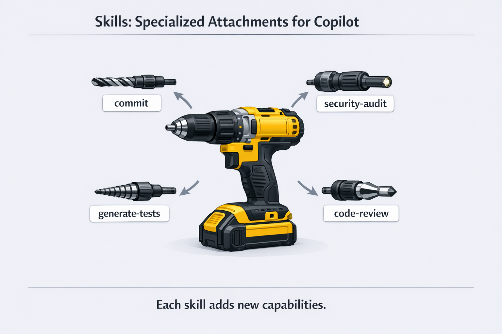

> **What if Copilot could automatically apply your team's best practices without you having to explain them every time?**

In this chapter, you'll learn about Agent Skills: folders of instructions that Copilot automatically loads when relevant to your task. While agents change *how* Copilot thinks, skills teach Copilot *specific ways to complete tasks*. You'll create a security audit skill that Copilot applies whenever you ask about security, build team-standard review criteria that ensure consistent code quality, and learn how skills work across Copilot CLI, VS Code, and the Copilot coding agent.

> 💡 **Skills are optional.** You can use GitHub Copilot CLI effectively without ever creating a skill. Skills are most valuable when you find yourself typing the same detailed prompts repeatedly, or when your team needs consistent code review criteria. If you're just getting started, feel free to skim this chapter and return when you have a repetitive task to automate.

## Learning Objectives

By the end of this chapter, you'll be able to:

- Understand how Agent Skills work (automatic loading, not manual commands)
- Create custom skills with SKILL.md files
- Use community skills from shared repositories
- Know when to use skills vs agents vs MCP

> ⏱️ **Estimated Time**: ~60 minutes (25 min reading + 35 min hands-on)

---

## Real-World Analogy: Power Tools

A general-purpose drill is useful, but specialized attachments make it powerful:

| Attachment | Purpose |
|------------|---------|
| Screwdriver bit | Drive screws quickly |
| Hole saw | Cut perfect circles |
| Sanding disc | Smooth surfaces |
| Wire brush | Remove rust |

Skills work the same way. They're specialized tools that extend what Copilot can do.



*Skills are specialized attachments that extend what Copilot can do*

---

## Understanding Skills

Agent Skills are folders containing instructions, scripts, and resources that Copilot **automatically loads when relevant** to your task. Copilot reads your prompt, checks if any skills match, and applies the relevant instructions automatically.

```bash
copilot

> Review books.py for code quality issues
# Copilot detects this matches your "code-review" skill
# and automatically applies its Python quality checklist

> Generate tests for the BookCollection class
# Copilot loads your "pytest-gen" skill
# and applies your preferred test structure

> What are the code quality issues in this file?
# Copilot loads your "code-review" skill
# and checks against your team's standards
```

> 💡 **Key Insight**: Skills are **automatically triggered** based on your prompt matching the skill's description. You don't need to type a special command - just ask naturally, and Copilot applies relevant skills behind the scenes.

> **Ready-to-use templates**: Check out the [samples/skills](../samples/skills/) folder for copy-paste skills you can use immediately.

### Coming from Chapter 04? Agents vs Skills

If you just learned about agents: **agents are who helps you** (expertise), **skills are what procedure they follow** (consistency). You can combine both for maximum power!

> 📖 For a detailed comparison table, see [Preview: Agents vs Skills](../04-agents-custom-instructions/README.md#preview-agents-vs-skills) in Chapter 04.

### Direct Slash Command Invocation

While auto-triggering is the primary way skills work, you can also **invoke skills directly** using their name as a slash command:

```bash
# Invoke a skill directly by name with your prompt
> /generate-tests Create tests for the user authentication module
> /code-review Check books.py for code quality issues
> /security-audit Review the API endpoints
```

This gives you explicit control when you want to ensure a specific skill is used.

> 📝 **Skills vs Agents Invocation**: Don't confuse skill invocation with agent invocation:
> - **Skills**: `/skill-name <prompt>` — e.g., `/code-review Check this file`
> - **Agents**: `/agent` (select from list) or `copilot --agent <name>` (command line)
> 
> If you have both a skill and an agent with the same name (e.g., "code-reviewer"), typing `/code-reviewer` invokes the **skill**, not the agent.

### How Do I Know a Skill Was Used?

You can ask Copilot directly:

```bash
> What skills did you use for that response?

# Or before asking:
> What skills do you have available for security reviews?
```

### Skills vs Agents vs MCP


*Three ways to extend GitHub Copilot CLI: Agents change how it thinks, Skills provide task-specific instructions, MCP connects to external services*

| Feature | What It Does | When to Use |
|---------|--------------|-------------|
| **Agents** | Changes how AI thinks | Need specialized expertise across many tasks |
| **Skills** | Provides task-specific instructions (auto-loaded) | Specific, repeatable tasks with detailed steps |
| **MCP** | Connects external services | Need live data from APIs |

**Quick rule**: Use agents for broad expertise, skills for specific task instructions, and MCP for external data.

> 📚 **Learn More**: See the official [About Agent Skills](https://docs.github.com/copilot/concepts/agents/about-agent-skills) documentation for the complete reference on skill formats and best practices.

---

## Finding and Using Community Skills

### Using Plugins to Install Skills

> 💡 **What are plugins?** Plugins are installable packages that can bundle skills, agents, and MCP server configurations together. Think of them as "app store" extensions for Copilot CLI.

The `/plugin` command lets you browse and install these packages:

```bash
copilot

> /plugin list
# Shows installed plugins

> /plugin marketplace
# Browse available plugins

> /plugin install <plugin-name>
# Install a plugin from the marketplace
```

Plugins can bundle multiple capabilities together - a single plugin might include related skills, agents, and MCP server configurations that work together.

### Community Skill Repositories

Pre-made skills are also available from community repositories:

- **[github/awesome-copilot](https://github.com/github/awesome-copilot)** - Official GitHub Copilot resources including skills documentation and examples

### Installing a Community Skill Manually

To use a community skill without the plugin system, copy its folder to your skills directory:

```bash
# Clone the awesome-copilot repository
git clone https://github.com/github/awesome-copilot.git /tmp/awesome-copilot

# Copy a specific skill to your skills directory
cp -r /tmp/awesome-copilot/skills/code-review ~/.copilot/skills/

# Or for project-specific use
cp -r /tmp/awesome-copilot/skills/code-review .github/skills/
```

### How Copilot Finds Skills

Copilot automatically scans these locations for skills:

| Location | Scope |
|----------|-------|
| `.github/skills/` | Project-specific (shared with team via git) |
| `.claude/skills/` | Project-specific (Claude Code compatible) |
| `~/.copilot/skills/` | Global (your personal skills) |
| `~/.claude/skills/` | Global (Claude Code compatible) |

> 💡 **Cross-Platform**: If you've already set up skills for Claude Code in `.claude/skills/`, Copilot picks them up automatically!

---

## From Manual Prompts to Automatic Expertise

> 💡 **Why show benefits first?** Before diving into how to create skills, let's see *why* they're worth learning. Once you see the consistency gains, the "how" will make more sense.

### Before Skills: Inconsistent Reviews

Every code review, you might forget something:

```bash
copilot

> Review this code for issues
# Generic review - might miss your team's specific concerns
```

Or you write a long prompt every time:

```bash
> Review this code checking for bare except clauses, missing type hints,
> mutable default arguments, missing context managers for file I/O,
> functions over 50 lines, print statements in production code...
```

Time: **30+ seconds** to type. Consistency: **varies by memory**.

### After Skills: Automatic Best Practices

With a `code-review` skill installed, just ask naturally:

```bash
copilot

> Review the book collection code for issues
```

**What happens behind the scenes**:
1. Copilot sees "review" and "issues" in your prompt
2. Checks skill descriptions, finds your `code-review` skill matches
3. Automatically loads your team's Python quality checklist
4. Applies all checks without you listing them

**Output**:
```
Code Review: books.py

[CRITICAL] Bare except clause (line 23)
  Catching all exceptions hides bugs
  Fix: Catch specific exceptions like FileNotFoundError

[HIGH] Missing type hints (line 45)
  Public function lacks type annotations
  Fix: Add type hints: def load_books(self) -> List[Book]:

[MEDIUM] Print statement in production code (line 67)
  Debug statement should be removed or use logging

✅ Context managers: File I/O uses proper with statements
✅ Function length: All functions under 50 lines
```

**The difference**: Your team's standards are applied automatically, every time, without typing them out.

---

<details>
<summary>🎬 See skill auto-triggering in action!</summary>


*Demo output varies — your model, tools, and responses will differ from what's shown here.*

</details>

---

## Consistency at Scale: Team PR Review Skill

Imagine your team has a 10-point PR checklist. Without a skill, every developer must remember all 10 points, and someone always forgets #6 or #9.

With a `pr-review` skill, the entire team gets consistent reviews:

```bash
copilot

> Can you review this PR?
```

Copilot automatically loads your team's `pr-review` skill and checks all 10 points:

```
PR Review: feature/user-auth

## Security ✅
- No hardcoded secrets
- Input validation present
- No bare except clauses

## Code Quality ⚠️
- [WARN] print statement on line 45 - remove before merge
- [WARN] TODO on line 78 missing issue reference
- [WARN] Missing type hints on public functions

## Testing ✅
- New tests added
- Edge cases covered

## Documentation ❌
- [FAIL] Breaking change not documented in CHANGELOG
- [FAIL] API changes need OpenAPI spec update
```

**The power**: Every team member applies the same standards automatically. New hires don't need to memorize the checklist because the skill handles it.

---

## Writing Good Skill Descriptions

The `description` field in your SKILL.md is crucial! It's how Copilot decides whether to load your skill:

```markdown
---
name: security-audit
description: Use for security reviews, vulnerability scanning,
  checking for SQL injection, XSS, authentication issues,
  OWASP Top 10 vulnerabilities, and security best practices
---
```

> 💡 **Tip**: Include keywords that match how you naturally ask questions. If you say "security review," include "security review" in the description.

### Combining Skills with Agents

Skills and agents work together. The agent provides expertise, the skill provides specific instructions:

```bash
# Start with a python-reviewer agent
copilot --agent python-reviewer

> Review the book app for issues
# python-reviewer agent's expertise combines
# with your code-review skill's checklist
```

---

## Managing Skills with the `/skills` Command

Use the `/skills` command to manage your installed skills:

| Command | What It Does |
|---------|--------------|
| `/skills list` | Show all installed skills |
| `/skills info <name>` | Get details about a specific skill |
| `/skills add <name>` | Enable a skill (from a repository or marketplace) |
| `/skills remove <name>` | Disable or uninstall a skill |
| `/skills reload` | Reload skills after editing SKILL.md files |

> 💡 **Remember**: You don't need to "activate" skills for each prompt. Once installed, skills are **automatically triggered** when your prompt matches their description. These commands are for managing which skills are available, not for using them.

### Example: View Your Skills

```bash
copilot

> /skills list

Available skills:
- security-audit: Security-focused code review checking OWASP Top 10
- generate-tests: Generate comprehensive unit tests with edge cases
- code-review: Team-standard code review checklist
...

> /skills info security-audit

Name: security-audit
Description: Security-focused code review checking OWASP Top 10 vulnerabilities
Location: ~/.copilot/skills/security-audit/
```

---

<details>
<summary>See it in action!</summary>


*Demo output varies — your model, tools, and responses will differ from what's shown here.*

</details>

---

### When to Use /skills reload

After creating or editing a skill's SKILL.md file, run `/skills reload` to pick up the changes without restarting Copilot:

```bash
# Edit your skill file
# Then in Copilot:
> /skills reload
Skills reloaded successfully.
```

> 💡 **Good to know**: Skills remain effective even after using `/compact` to summarize your conversation history. No need to reload after compacting.

---

## Creating Custom Skills

Skills are stored in `~/.copilot/skills/` (global) or `.github/skills/` (project-specific).

### Skill Structure

Each skill lives in its own folder with a `SKILL.md` file. You can optionally include scripts, examples, or other resources:

```
~/.copilot/skills/
└── my-skill/
    ├── SKILL.md           # Required: Skill definition and instructions
    ├── examples/          # Optional: Example files Copilot can reference
    │   └── sample.py
    └── scripts/           # Optional: Scripts the skill can use
        └── validate.sh
```

> 💡 **Tip**: The directory name should match the `name` in your SKILL.md frontmatter (lowercase with hyphens).

### SKILL.md Format

Skills use a simple markdown format with YAML frontmatter:

```markdown
---
name: my-code-review
description: Comprehensive code review with security, performance, and maintainability checks
license: MIT
---

# Code Review

When reviewing code, check for:

## Security
- SQL injection vulnerabilities
- XSS vulnerabilities
- Authentication/authorization issues
- Sensitive data exposure

## Performance
- N+1 query problems (running one query per item instead of one query for all items)
- Unnecessary loops or computations
- Memory leaks
- Blocking operations

## Maintainability
- Function length (flag functions > 50 lines)
- Code duplication
- Missing error handling
- Unclear naming

## Output Format
Provide issues as a numbered list with severity:
- [CRITICAL] - Must fix before merge
- [HIGH] - Should fix before merge
- [MEDIUM] - Should address soon
- [LOW] - Nice to have
```

**YAML Properties:**

| Property | Required | Description |
|----------|----------|-------------|
| `name` | **Yes** | Unique identifier (lowercase, hyphens for spaces) |
| `description` | **Yes** | What the skill does and when Copilot should use it |
| `license` | No | License that applies to this skill |

> 📖 **Official docs**: [About Agent Skills](https://docs.github.com/copilot/concepts/agents/about-agent-skills)

### Creating Your First Skill

```bash
# Create skill directory
mkdir -p ~/.copilot/skills/security-audit

# Create the SKILL.md file
cat > ~/.copilot/skills/security-audit/SKILL.md << 'EOF'
---
name: security-audit
description: Security-focused code review checking OWASP (Open Web Application Security Project) Top 10 vulnerabilities
---

# Security Audit

Perform a security audit checking for:

## Injection Vulnerabilities
- SQL injection (string concatenation in queries)
- Command injection (unsanitized shell commands)
- LDAP injection
- XPath injection

## Authentication Issues
- Hardcoded credentials
- Weak password requirements
- Missing rate limiting
- Session management flaws

## Sensitive Data
- Plaintext passwords
- API keys in code
- Logging sensitive information
- Missing encryption

## Access Control
- Missing authorization checks
- Insecure direct object references
- Path traversal vulnerabilities

## Output
For each issue found, provide:
1. File and line number
2. Vulnerability type
3. Severity (CRITICAL/HIGH/MEDIUM/LOW)
4. Recommended fix
EOF

# Test your skill (skills load automatically based on your prompt)
copilot

> @samples/book-app-project/ Check this code for security vulnerabilities
# Copilot detects "security vulnerabilities" matches your skill
# and automatically applies its OWASP checklist
```

---

## Hands-On Examples

Here are two examples showing different skill patterns. More examples are available in [samples/skills/](../samples/skills/).

### Example 1: pytest Test Generation Skill

A skill that ensures consistent pytest structure across your codebase:

```bash
# Create skill
mkdir -p ~/.copilot/skills/pytest-gen

cat > ~/.copilot/skills/pytest-gen/SKILL.md << 'EOF'
---
name: pytest-gen
description: Generate comprehensive pytest tests with fixtures and edge cases
---

# pytest Test Generation

Generate pytest tests that include:

## Test Structure
- Use pytest conventions (test_ prefix)
- One assertion per test when possible
- Clear test names describing expected behavior
- Use fixtures for setup/teardown

## Coverage
- Happy path scenarios
- Edge cases: None, empty strings, empty lists
- Boundary values
- Error scenarios with pytest.raises()

## Fixtures
- Use @pytest.fixture for reusable test data
- Use tmpdir/tmp_path for file operations
- Mock external dependencies with pytest-mock

## Output
Provide complete, runnable test file with proper imports.
EOF
```

### Example 2: Team PR Review Skill

A skill that enforces consistent PR review standards across your team:

```bash
mkdir -p ~/.copilot/skills/pr-review

cat > ~/.copilot/skills/pr-review/SKILL.md << 'EOF'
---
name: pr-review
description: Team-standard PR review checklist
---

# PR Review

Review code changes against team standards:

## Security Checklist
- [ ] No hardcoded secrets or API keys
- [ ] Input validation on all user data
- [ ] No bare except clauses
- [ ] No sensitive data in logs

## Code Quality
- [ ] Functions under 50 lines
- [ ] No print statements in production code
- [ ] Type hints on public functions
- [ ] Context managers for file I/O
- [ ] No TODOs without issue references

## Testing
- [ ] New code has tests
- [ ] Edge cases covered
- [ ] No skipped tests without explanation

## Documentation
- [ ] API changes documented
- [ ] Breaking changes noted
- [ ] README updated if needed

## Output Format
Provide results as:
- ✅ PASS: Items that look good
- ⚠️ WARN: Items that could be improved
- ❌ FAIL: Items that must be fixed before merge
EOF
```

---

## 🎯 Try It Yourself

After completing the demos, try these variations:

1. **Skill Creation Challenge**: Create a `quick-review` skill that does a 3-point checklist:
   - Bare except clauses
   - Missing type hints
   - Unclear variable names

   Test it by asking: "Do a quick review of books.py"

2. **Skill Comparison**: Time yourself writing a detailed security review prompt manually. Then just ask "Check for security issues in this file" and let your security-audit skill load automatically. How much time did the skill save?

3. **Team Skill Challenge**: Think about your team's code review checklist. Could you encode it as a skill? Write down 3 things the skill should always check.

**Self-Check**: You understand skills when you can explain why the `description` field matters (it's how Copilot decides whether to load your skill).

---

## Assignment

### Main Challenge: Build a Book Summary Skill

The hands-on examples created `pytest-gen` and `pr-review` skills. Now practice creating a completely different kind of skill — one for generating formatted output from data:

1. List your current skills: `ls ~/.copilot/skills/`
2. Create a `book-summary` skill at `~/.copilot/skills/book-summary/SKILL.md` that generates a formatted markdown summary of the book collection
3. Your skill should have:
   - Clear name and description (description is crucial for matching!)
   - Specific formatting rules (e.g., markdown table with title, author, year, read status)
   - Output conventions (e.g., use ✅/❌ for read status, sort by year)
4. Test the skill: `@samples/book-app-project/data.json Summarize the books in this collection`
5. Verify the skill auto-triggers by checking `/skills list`

**Success criteria**: You have a working `book-summary` skill that Copilot automatically applies when you ask about the book collection.

<details>
<summary>💡 Hints (click to expand)</summary>

**Starter template** — Create `~/.copilot/skills/book-summary/SKILL.md`:

```markdown
---
name: book-summary
description: Generate a formatted markdown summary of a book collection
---

# Book Summary Generator

Generate a summary of the book collection following these rules:

1. Output a markdown table with columns: Title, Author, Year, Status
2. Use ✅ for read books and ❌ for unread books
3. Sort by year (oldest first)
4. Include a total count at the bottom
5. Flag any data issues (missing authors, invalid years)

Example:
| Title | Author | Year | Status |
|-------|--------|------|--------|
| 1984 | George Orwell | 1949 | ✅ |
| Dune | Frank Herbert | 1965 | ❌ |

**Total: 2 books (1 read, 1 unread)**
```

**Test it:**
```bash
copilot
> @samples/book-app-project/data.json Summarize the books in this collection
# The skill should auto-trigger based on the description match
```

**If it doesn't trigger:** Try `/skills reload` then ask again.

</details>

### Bonus Challenge: Commit Message Skill

1. Create a `commit-message` skill that generates conventional commit messages with a consistent format
2. Test it by staging a change and asking: "Generate a commit message for my staged changes"
3. Document your skill and share it on GitHub with the `copilot-skill` topic

---

<details>
<summary>🔧 <strong>Common Mistakes & Troubleshooting</strong> (click to expand)</summary>

### Common Mistakes

| Mistake | What Happens | Fix |
|---------|--------------|-----|
| Naming the file something other than `SKILL.md` | Skill won't be recognized | The file must be named exactly `SKILL.md` |
| Vague `description` field | Skill never gets loaded automatically | Description is the PRIMARY discovery mechanism. Use specific trigger words |
| Missing `name` or `description` in frontmatter | Skill fails to load | Add both fields in YAML frontmatter |
| Wrong folder location | Skill not found | Use `~/.copilot/skills/skill-name/` (personal) or `.github/skills/` (project) |

### Troubleshooting

**Skill not being used** - If Copilot isn't using your skill when expected:

1. **Check the description**: Does it match how you're asking?
   ```markdown
   # Bad: Too vague
   description: Reviews code

   # Good: Includes trigger words
   description: Use for code reviews, checking code quality,
     finding bugs, security issues, and best practice violations
   ```

2. **Verify the file location**:
   ```bash
   # Global skills
   ls ~/.copilot/skills/

   # Project skills
   ls .github/skills/
   ```

3. **Check SKILL.md format**: Frontmatter is required:
   ```markdown
   ---
   name: skill-name
   description: What the skill does and when to use it
   ---

   # Instructions here
   ```

**Skill not appearing** - Verify the folder structure:
```
~/.copilot/skills/
└── my-skill/           # Folder name
    └── SKILL.md        # Must be exactly SKILL.md (case-sensitive)
```

**Testing if a skill loads** - Ask Copilot directly:
```bash
> What skills do you have available for code review?
# Copilot will describe relevant skills it found
```

**How do I know my skill is actually working?**

1. **Check the output format**: If your skill specifies an output format (like `[CRITICAL]` tags), look for that in the response
2. **Ask directly**: After getting a response, ask "Did you use any skills for that?"
3. **Compare with/without**: Try the same prompt with `--no-custom-instructions` to see the difference:
   ```bash
   # With skills
   copilot --allow-all -p "Review @file.py for security issues"

   # Without skills (baseline comparison)
   copilot --allow-all -p "Review @file.py for security issues" --no-custom-instructions
   ```
4. **Check for specific checks**: If your skill includes specific checks (like "functions over 50 lines"), see if those appear in the output

</details>

---

## Key Takeaways

1. **Skills are automatic**: Copilot loads them when your prompt matches the skill's description
2. **Direct invocation**: You can also invoke skills directly with `/skill-name` as a slash command
3. **SKILL.md format**: YAML frontmatter (name, description, optional license) plus markdown instructions
4. **Locations matter**: `.github/skills/` for team sharing, `~/.copilot/skills/` for personal use
5. **Cross-platform**: Same skill format works in GitHub Copilot CLI, VS Code, and Claude Code
6. **Description is key**: Write descriptions that match how you naturally ask questions

> 📋 **Quick Reference**: See the [Command Cheat Sheet](../QUICK-REFERENCE.md) for a complete list of commands and shortcuts.

---

## What's Next

Skills extend what Copilot can do with auto-loaded instructions. But what about connecting to external services? That's where MCP comes in.

In **[Chapter 06: MCP Servers](../06-mcp-servers/README.md)**, you'll learn:

- What MCP (Model Context Protocol) is
- Connecting to GitHub, filesystem, and documentation services
- Configuring MCP servers
- Multi-server workflows

---

**[← Back to Chapter 04](../04-agents-custom-instructions/README.md)** | **[Continue to Chapter 06 →](../06-mcp-servers/README.md)**
