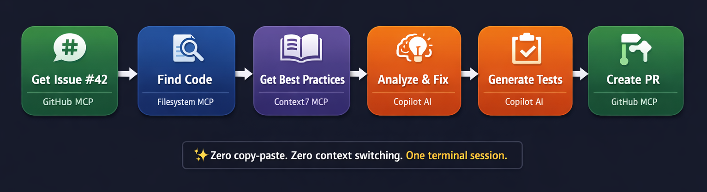

> **What if Copilot could read your GitHub issues, check your database, and create PRs... all from the terminal?**

So far, Copilot can only work with what you give it directly: files you reference with `@`, conversation history, and its own training data. But what if it could reach out on its own to check your GitHub repository, browse your project files, or look up the latest documentation for a library?

That's what MCP (Model Context Protocol) does. It's a way to connect Copilot to external services so it has access to live, real-world data. Each service Copilot connects to is called an "MCP server." In this chapter, you'll set up a few of these connections and see how they make Copilot dramatically more useful.

> 💡 **Already familiar with MCP?** [Jump to the quick start](#-use-the-built-in-github-mcp) to confirm it's working and start configuring servers.

## 🎯 Learning Objectives

By the end of this chapter, you'll be able to:

- Understand what MCP is and why it matters
- Manage MCP servers using `/mcp` commands
- Configure MCP servers for GitHub, filesystem, and documentation
- Use MCP-powered workflows with the book app project
- Know when and how to build a custom MCP server (optional)

> ⏱️ **Estimated Time**: ~45 minutes (20 min reading + 25 min hands-on). GitHub MCP works out of the box; configuring additional servers takes ~10-15 minutes.

---

## 🧩 Real-World Analogy: Browser Extensions

Think of MCP servers like browser extensions. Your browser on its own can display web pages, but extensions connect it to extra services:

| Browser Extension | What It Connects To | MCP Equivalent |
|-------------------|---------------------|----------------|
| Password manager | Your password vault | **GitHub MCP** → your repos, issues, PRs |
| Grammarly | Writing analysis service | **Context7 MCP** → library documentation |
| File manager | Cloud storage | **Filesystem MCP** → local project files |

Without extensions, your browser is still useful, but with them, it becomes a powerhouse. MCP servers do the same for Copilot. They connect it to real, live data sources so it can read your GitHub issues, explore your file system, fetch up-to-date documentation, and more.

> 💡 **Key insight**: Without MCP, Copilot can only see files you explicitly share with `@`. With MCP, it can proactively explore your project, check your GitHub repo, and look up documentation, all automatically.


*MCP servers connect Copilot to the outside world: GitHub, repositories, documentation, and more*

---

# Quick Start: MCP in 30 Seconds

Let's see MCP in action right now, before configuring anything.

---

## 🚀 Use the Built-in GitHub MCP

The GitHub MCP server is included by default. Try this:

```bash
copilot
> List the recent commits in this repository
```

If Copilot returns real commit data, you've just seen MCP in action. That's the GitHub MCP server reaching out to GitHub on your behalf. But GitHub is just *one* server. This chapter shows you how to add more (filesystem access, up-to-date documentation, and others) so Copilot can do even more.

---

## 🛠️ The `/mcp show` Command

Use `/mcp show` to see which MCP servers are configured and whether they're enabled:

```bash
copilot

> /mcp show

MCP Servers:
✓ github (enabled) - GitHub integration
✓ filesystem (enabled) - File system access
```

> 💡 **Only seeing the GitHub server?** That's expected! If you haven't added any additional MCP servers yet, GitHub is the only one listed. You'll add more in the next section.

> 📚 **Want to see all `/mcp` commands?** There are additional commands for adding, editing, enabling, and deleting servers. See the [full command reference](#-additional-mcp-commands) at the end of this chapter.

<details>
<summary>🎬 See it in action!</summary>


*Demo output varies. Your model, tools, and responses will differ from what's shown here.*

</details>

---

## 🧠 What Changes with MCP?

Here's the difference MCP makes in practice:

**Without MCP:**
```bash
> What's in GitHub issue #42?

"I don't have access to GitHub. You'll need to copy and paste the issue content."
```

**With MCP:**
```bash
> What's in GitHub issue #42 of this repository?

Issue #42: Login fails with special characters
Status: Open
Labels: bug, priority-high
Description: Users report that passwords containing...
```

MCP makes Copilot aware of your actual development environment.

> 📚 **Official Documentation**: [About MCP](https://docs.github.com/copilot/concepts/context/mcp) for a deeper look at how MCP works with GitHub Copilot.

---

# Configuring MCP Servers

Now that you've seen MCP in action, let's set up additional servers. This section covers the configuration file format and how to add new servers.

---

## 📁 MCP Configuration File

MCP servers are configured in `~/.copilot/mcp-config.json` (global) or `.copilot/mcp-config.json` (project). 

```json
{
  "mcpServers": {
    "server-name": {
      "type": "local",
      "command": "npx",
      "args": ["@package/server-name"],
      "tools": ["*"]
    }
  }
}
```

*Most MCP servers are distributed as npm packages and run via the `npx` command.*

<details>
<summary>💡 <strong>New to JSON?</strong> Click here to learn what each field means</summary>

| Field | What It Means |
|-------|---------------|
| `"mcpServers"` | Container for all your MCP server configurations |
| `"server-name"` | A name you choose (e.g., "github", "filesystem") |
| `"type": "local"` | The server runs on your machine |
| `"command": "npx"` | The program to run (npx runs npm packages) |
| `"args": [...]` | Arguments passed to the command |
| `"tools": ["*"]` | Allow all tools from this server |

**Important JSON rules:**
- Use double quotes `"` for strings (not single quotes)
- No trailing commas after the last item
- File must be valid JSON (use a [JSON validator](https://jsonlint.com/) if unsure)

</details>

---

## ➕ Adding MCP Servers

The GitHub MCP server is built-in and requires no setup. Below are additional servers you can add. **Pick what interests you, or work through them in order.**

| I want to... | Jump to |
|---|---|
| Let Copilot browse my project files | [Filesystem Server](#filesystem-server) |
| Get up-to-date library documentation | [Context7 Server](#context7-server-documentation) |
| Explore optional extras (custom servers, web_fetch) | [Beyond the Basics](#beyond-the-basics) |

<details>
<summary><strong>Filesystem Server</strong> - Let Copilot explore your project files</summary>
<a id="filesystem-server"></a>

### Filesystem Server

```json
{
  "mcpServers": {
    "filesystem": {
      "type": "local",
      "command": "npx",
      "args": ["-y", "@modelcontextprotocol/server-filesystem", "."],
      "tools": ["*"]
    }
  }
}
```

> 💡 **The `.` path**: The `.` means "current directory". Copilot can access files relative to where you launched it. In a Codespace, this is your workspace root. You can also use an absolute path like `/workspaces/github-copilot-cli-for-beginners` if you prefer.

Add this to your `~/.copilot/mcp-config.json` and restart Copilot.

</details>

<details>
<summary><strong>Context7 Server</strong> - Get up-to-date library docs</summary>
<a id="context7-server-documentation"></a>

### Context7 Server (Documentation)

Context7 gives Copilot access to up-to-date documentation for popular frameworks and libraries. Instead of relying on training data that might be outdated, Copilot fetches the actual current documentation.

```json
{
  "mcpServers": {
    "context7": {
      "type": "local",
      "command": "npx",
      "args": ["-y", "@upstash/context7-mcp"],
      "tools": ["*"]
    }
  }
}
```

✅ **No API key required** · ✅ **No account needed** · ✅ **Your code stays local**

Add this to your `~/.copilot/mcp-config.json` and restart Copilot.

</details>

<details>
<summary><strong>Beyond the Basics</strong> - Custom servers and web access (optional)</summary>
<a id="beyond-the-basics"></a>

These are optional extras for when you're comfortable with the core servers above.

### Building a Custom MCP Server

Want to connect Copilot to your own APIs, databases, or internal tools? You can build a custom MCP server in Python. This is completely optional since the pre-built servers (GitHub, filesystem, Context7) cover most use cases.

📖 See the [Custom MCP Server Guide](mcp-custom-server.md) for a complete walkthrough using the book app as an example.

📚 For more background, see the [MCP for Beginners course](https://github.com/microsoft/mcp-for-beginners).

### Web Access with `web_fetch`

Copilot CLI includes a built-in `web_fetch` tool that can fetch content from any URL. This is useful for pulling in READMEs, API docs, or release notes without leaving your terminal. No MCP server needed.

You can control which URLs are accessible via `~/.copilot/config.json` (general Copilot settings), which is separate from `~/.copilot/mcp-config.json` (MCP server definitions).

```json
{
  "permissions": {
    "allowedUrls": [
      "https://api.github.com/**",
      "https://docs.github.com/**",
      "https://*.npmjs.org/**"
    ],
    "blockedUrls": [
      "http://**"
    ]
  }
}
```

**Usage:**
```bash
copilot

> Fetch and summarize the README from https://github.com/facebook/react
```

</details>

### Complete Configuration File
<a id="complete-configuration-file"></a>

Here's a full `mcp-config.json` with filesystem and Context7 servers:

> 💡 **Note:** GitHub MCP is built-in — you don't need to add it to your config file.

```json
{
  "mcpServers": {
    "filesystem": {
      "type": "local",
      "command": "npx",
      "args": ["-y", "@modelcontextprotocol/server-filesystem", "."],
      "tools": ["*"]
    },
    "context7": {
      "type": "local",
      "command": "npx",
      "args": ["-y", "@upstash/context7-mcp"],
      "tools": ["*"]
    }
  }
}
```

Save this as `~/.copilot/mcp-config.json` for global access or `.copilot/mcp-config.json` for project-specific configuration.

---

## 🔧 Using Your MCP Servers

Now that you have MCP servers configured, let's see what they can do. **Pick a server to explore, or work through them in order.**

| I want to try... | Jump to |
|---|---|
| GitHub repos, issues, and PRs | [GitHub Server](#github-server-built-in) |
| Browsing project files | [Filesystem Server Usage](#filesystem-server-usage) |
| Library documentation lookup | [Context7 Server Usage](#context7-server-usage) |
| Custom server and web_fetch usage | [Beyond the Basics Usage](#beyond-the-basics-usage) |

<details>
<summary><strong>GitHub Server (Built-in)</strong> - Access repos, issues, PRs, and more</summary>
<a id="github-server-built-in"></a>

### GitHub Server (Built-in)

The GitHub MCP server is **built-in** — if you logged into Copilot (which you did during initial setup), it already works. No configuration needed!

> 💡 **Not working?** Run `/login` to re-authenticate with GitHub.

<details>
<summary><strong>Authentication in Dev Containers</strong></summary>

- **GitHub Codespaces** (recommended): Authentication is automatic. The `gh` CLI inherits your Codespace token. No action needed.
- **Local dev container (Docker)**: Run `gh auth login` after the container starts, then restart Copilot.

**Troubleshooting authentication:**
```bash
# Check if you're authenticated
gh auth status

# If not, log in
gh auth login

# Verify GitHub MCP is connected
copilot
> /mcp show
```

</details>

| Feature | Example |
|---------|----------|
| **Repository info** | View commits, branches, contributors |
| **Issues** | List, create, search, and comment on issues |
| **Pull requests** | View PRs, diffs, create PRs, check status |
| **Code search** | Search code across repositories |
| **Actions** | Query workflow runs and status |

```bash
copilot

# See recent activity in this repo
> List the last 5 commits in this repository

Recent commits:
1. abc1234 - Update chapter 05 skills examples (2 days ago)
2. def5678 - Add book app test fixtures (3 days ago)
3. ghi9012 - Fix typo in chapter 03 README (4 days ago)
...

# Explore the repo structure
> What branches exist in this repository?

Branches:
- main (default)
- chapter6 (current)

# Search for code patterns across the repo
> Search this repository for files that import pytest

Found 1 file:
- samples/book-app-project/tests/test_books.py
```

> 💡 **Working on your own fork?** If you forked this course repo, you can also try write operations like creating issues and pull requests. We'll practice that in the exercises below.

> ⚠️ **Don't see results?** The GitHub MCP operates on the repository's remote (on github.com), not just local files. Make sure your repo has a remote: run `git remote -v` to check.

</details>

<details>
<summary><strong>Filesystem Server</strong> - Browse and analyze project files</summary>
<a id="filesystem-server-usage"></a>

### Filesystem Server

Once configured, the filesystem MCP provides tools that Copilot can use automatically:

```bash
copilot

> How many Python files are in the book-app-project directory?

Found 3 Python files in samples/book-app-project/:
- book_app.py
- books.py
- utils.py

> What's the total size of the data.json file?

samples/book-app-project/data.json: 2.4 KB

> Find all functions that don't have type hints in the book app

Found 2 functions without type hints:
- samples/book-app-project/utils.py:10 - get_user_choice()
- samples/book-app-project/utils.py:14 - get_book_details()
```

</details>

<details>
<summary><strong>Context7 Server</strong> - Look up library documentation</summary>
<a id="context7-server-usage"></a>

### Context7 Server

```bash
copilot

> What are the best practices for using pytest fixtures?

From pytest Documentation:

Fixtures - Use fixtures to provide a fixed baseline for tests:

    import pytest

    @pytest.fixture
    def sample_books():
        return [
            {"title": "1984", "author": "George Orwell", "year": 1949},
            {"title": "Dune", "author": "Frank Herbert", "year": 1965},
        ]

    def test_find_by_author(sample_books):
        # fixture is automatically passed as argument
        results = [b for b in sample_books if "Orwell" in b["author"]]
        assert len(results) == 1

Best practices:
- Use fixtures instead of setup/teardown methods
- Use tmp_path fixture for temporary files
- Use monkeypatch for modifying environment
- Scope fixtures appropriately (function, class, module, session)

> How can I apply this to the book app's test file?

# Copilot now knows the official pytest patterns
# and can apply them to samples/book-app-project/tests/test_books.py
```

</details>

<details>
<summary><strong>Beyond the Basics</strong> - Custom server and web_fetch usage</summary>
<a id="beyond-the-basics-usage"></a>

### Beyond the Basics

**Custom MCP Server**: If you built the book-lookup server from the [Custom MCP Server Guide](mcp-custom-server.md), you can query your book collection directly:

```bash
copilot

> Look up information about "1984" using the book lookup server
> Search for books by George Orwell
```

**Web Fetch**: Use the built-in `web_fetch` tool to pull in content from any URL:

```bash
copilot

> Fetch and summarize the README from https://github.com/facebook/react
```

</details>

---

## 🔗 Multi-Server Workflows

These workflows show why developers say "I never want to work without this again." Each example combines multiple MCP servers in a single session.



*Complete MCP workflow: GitHub MCP retrieves repo data, Filesystem MCP finds code, Context7 MCP provides best practices, and Copilot handles analysis*

Each example below is self-contained. **Pick one that interests you, or read them all.**

| I want to see... | Jump to |
|---|---|
| Multiple servers working together | [Multi-Server Exploration](#multi-server-exploration) |
| Going from issue to PR in one session | [Issue-to-PR Workflow](#issue-to-pr-workflow) |
| A quick project health check | [Health Dashboard](#health-dashboard) |

<details>
<summary><strong>Multi-Server Exploration</strong> - Combine filesystem, GitHub, and Context7 in one session</summary>
<a id="multi-server-exploration"></a>

#### Exploring the Book App with Multiple MCP Servers

```bash
copilot

# Step 1: Use filesystem MCP to explore the book app
> List all Python files in samples/book-app-project/ and summarize
> what each file does

Found 3 Python files:
- book_app.py: CLI entry point with command routing (list, add, remove, find)
- books.py: BookCollection class with data persistence via JSON
- utils.py: Helper functions for user input and display

# Step 2: Use GitHub MCP to check recent changes
> What were the last 3 commits that touched files in samples/book-app-project/?

Recent commits affecting book app:
1. abc1234 - Add test fixtures for BookCollection (2 days ago)
2. def5678 - Add find_by_author method (5 days ago)
3. ghi9012 - Initial book app setup (1 week ago)

# Step 3: Use Context7 MCP for best practices
> What are Python best practices for JSON data persistence?

From Python Documentation:
- Use context managers (with statements) for file I/O
- Handle JSONDecodeError for corrupted files
- Use dataclasses for structured data
- Consider atomic writes to prevent data corruption

# Step 4: Synthesize a recommendation
> Based on the book app code and these best practices,
> what improvements would you suggest?

Suggestions:
1. Add input validation in add_book() for empty strings and invalid years
2. Consider atomic writes in save_books() to prevent data corruption
3. Add type hints to utils.py functions (get_user_choice, get_book_details)
```

<details>
<summary>🎬 See the MCP workflow in action!</summary>


*Demo output varies. Your model, tools, and responses will differ from what's shown here.*

</details>

**The result**: Code exploration → history review → best practices lookup → improvement plan. **All from one terminal session, using three MCP servers together.**

</details>

<details>
<summary><strong>Issue-to-PR Workflow</strong> - Go from a GitHub issue to a pull request without leaving the terminal</summary>
<a id="issue-to-pr-workflow"></a>

#### The Issue-to-PR Workflow (On Your Own Repo)

This works best on your own fork or repository where you have write access:

> 💡 **Don't worry if you can't try this right now.** If you're on a read-only clone, you'll practice this in the assignment. For now, just read through to understand the flow.

```bash
copilot

> Get the details of GitHub issue #1

Issue #1: Add input validation for book year
Status: Open
Description: The add_book function accepts any year value...

> @samples/book-app-project/books.py Fix the issue described in issue #1

[Copilot implements year validation in add_book()]

> Run the tests to make sure the fix works

All 8 tests passed ✓

> Create a pull request titled "Add year validation to book app"

✓ Created PR #2: Add year validation to book app
```

**Zero copy-paste. Zero context switching. One terminal session.**

</details>

<details>
<summary><strong>Health Dashboard</strong> - Get a quick project health check using multiple servers</summary>
<a id="health-dashboard"></a>

#### Book App Health Dashboard

```bash
copilot

> Give me a health report for the book app project:
> 1. List all functions across the Python files in samples/book-app-project/
> 2. Check which functions have type hints and which don't
> 3. Show what tests exist in samples/book-app-project/tests/
> 4. Check the recent commit history for this directory

Book App Health Report
======================

📊 Functions Found:
- books.py: 8 methods in BookCollection (all have type hints ✓)
- book_app.py: 6 functions (4 have type hints, 2 missing)
- utils.py: 3 functions (1 has type hints, 2 missing)

🧪 Test Coverage:
- test_books.py: 8 test functions covering BookCollection
- Missing: no tests for book_app.py CLI functions
- Missing: no tests for utils.py helper functions

📝 Recent Activity:
- 3 commits in the last week
- Most recent: added test fixtures

Recommendations:
- Add type hints to utils.py functions
- Add tests for book_app.py CLI handlers
- All files well-sized (<100 lines) - good structure!
```

**The result**: Multiple data sources aggregated in seconds. Manually, this would mean running grep, counting lines, checking git log, and browsing test files. Easily 15+ minutes of work.

</details>

---

# Practice

**🎉 You now know the essentials!** You understand MCP, you've seen how to configure servers, and you've seen real workflows in action. Now it's time to try it yourself.

---

## 🔧 Hands-On: MCP with the Book App

Now it's your turn! Complete these exercises to practice using MCP servers with the book app project.

### 📋 Exercise 1: Check Your MCP Status

Start by seeing what MCP servers are available:

```bash
copilot

> /mcp show
```

You should see the GitHub server listed as enabled. If not, run `/login` to authenticate.

---

### 📋 Exercise 2: Explore the Book App with Filesystem MCP

If you've configured the filesystem server, use it to explore the book app:

```bash
copilot

> How many Python files are in samples/book-app-project/?
> What functions are defined in each file?
```

**Expected result**: Copilot lists `book_app.py`, `books.py`, and `utils.py` with their functions.

> 💡 **Don't have filesystem MCP configured yet?** Create the config file from the [Complete Configuration](#complete-configuration-file) section above. Then restart Copilot.

---

### 📋 Exercise 3: Query Repository History with GitHub MCP

Use the built-in GitHub MCP to explore this course repository:

```bash
copilot

> List the last 5 commits in this repository

> What branches exist in this repository?
```

**Expected result**: Copilot shows recent commit messages and branch names from the GitHub remote.

> ⚠️ **In a Codespace?** This works automatically. Authentication is inherited. If you're on a local clone, make sure `gh auth status` shows you're logged in.

---

### 📋 Exercise 4: Combine Multiple MCP Servers

Now combine filesystem and GitHub MCP in a single session:

```bash
copilot

> Read samples/book-app-project/data.json and tell me what books are
> in the collection. Then check the recent commits to see when this
> file was last modified.
```

**Expected result**: Copilot reads the JSON file (filesystem MCP), lists the 5 books including "The Hobbit", "1984", "Dune", "To Kill a Mockingbird", and "Mysterious Book", then queries GitHub for commit history.

**Self-Check**: You understand MCP when you can explain why "Check my repo's commit history" is better than manually running `git log` and pasting the output into your prompt.

---

## 📝 Assignment

### Main Challenge: Book App MCP Exploration

Practice using MCP servers together on the book app project. Complete these steps in a single Copilot session:

1. **Verify MCP is working**: Run `/mcp show` and confirm at least the GitHub server is enabled
2. **Set up filesystem MCP** (if not already done): Create `~/.copilot/mcp-config.json` with the filesystem server configuration
3. **Explore the code**: Ask Copilot to use the filesystem server to:
   - List all functions in `samples/book-app-project/books.py`
   - Check which functions in `samples/book-app-project/utils.py` are missing type hints
   - Read `samples/book-app-project/data.json` and identify any data quality issues (hint: look at the last entry)
4. **Check repository activity**: Ask Copilot to use GitHub MCP to:
   - List recent commits that touched files in `samples/book-app-project/`
   - Check if there are any open issues or pull requests
5. **Combine servers**: In a single prompt, ask Copilot to:
   - Read the test file at `samples/book-app-project/tests/test_books.py`
   - Compare the tested functions against all functions in `books.py`
   - Summarize what test coverage is missing

**Success criteria**: You can seamlessly combine filesystem and GitHub MCP data in a single Copilot session, and you can explain what each MCP server contributed to the response.

<details>
<summary>💡 Hints (click to expand)</summary>

**Step 1: Verify MCP**
```bash
copilot
> /mcp show
# Should show "github" as enabled
# If not, run: /login
```

**Step 2: Create the config file**

Use the JSON from the [Complete Configuration](#complete-configuration-file) section above and save it as `~/.copilot/mcp-config.json`.

**Step 3: Data quality issue to look for**

The last book in `data.json` is:
```json
{
  "title": "Mysterious Book",
  "author": "",
  "year": 0,
  "read": false
}
```
An empty author and year of 0. That's the data quality issue!

**Step 5: Test coverage comparison**

The tests in `test_books.py` cover: `add_book`, `mark_as_read`, `remove_book`, `get_unread_books`, and `find_book_by_title`. Functions like `load_books`, `save_books`, and `list_books` don't have direct tests. The CLI functions in `book_app.py` and helpers in `utils.py` have no tests at all.

**If MCP isn't working:** Restart Copilot after editing the config file.

</details>

### Bonus Challenge: Build a Custom MCP Server

Ready to go deeper? Follow the [Custom MCP Server Guide](mcp-custom-server.md) to build your own MCP server in Python that connects to any API.

---

<details>
<summary>🔧 <strong>Common Mistakes & Troubleshooting</strong> (click to expand)</summary>

### Common Mistakes

| Mistake | What Happens | Fix |
|---------|--------------|-----|
| Not knowing GitHub MCP is built-in | Trying to install/configure it manually | GitHub MCP is included by default. Just try: "List the recent commits in this repo" |
| Looking for config in wrong location | Can't find or edit MCP settings | Config is in `~/.copilot/mcp-config.json` |
| Invalid JSON in config file | MCP servers fail to load | Use `/mcp show` to check configuration; validate JSON syntax |
| Forgetting to authenticate MCP servers | "Authentication failed" errors | Some MCPs need separate auth. Check each server's requirements |

### Troubleshooting

**"MCP server not found"** - Check that:
1. The npm package exists: `npm view @modelcontextprotocol/server-github`
2. Your configuration is valid JSON
3. The server name matches your config

Use `/mcp show` to see the current configuration.

**"GitHub authentication failed"** - The built-in GitHub MCP uses your `/login` credentials. Try:

```bash
copilot
> /login
```

This will re-authenticate you with GitHub. If issues persist, check that your GitHub account has the necessary permissions for the repository you're accessing.

**"MCP server failed to start"** - Check the server logs:
```bash
# Run the server command manually to see errors
npx -y @modelcontextprotocol/server-github
```

**MCP tools not available** - Make sure the server is enabled:
```bash
copilot

> /mcp show
# Check if server is listed and enabled
```

If a server is disabled, see the [additional `/mcp` commands](#-additional-mcp-commands) below for how to re-enable it.

</details>

---

<details>
<summary>📚 <strong>Additional <code>/mcp</code> Commands</strong> (click to expand)</summary>
<a id="-additional-mcp-commands"></a>

Beyond `/mcp show`, there are several other commands for managing your MCP servers:

| Command | What It Does |
|---------|--------------|
| `/mcp show` | Show all configured MCP servers and their status |
| `/mcp add` | Interactive setup for adding a new server |
| `/mcp edit <server-name>` | Edit an existing server configuration |
| `/mcp enable <server-name>` | Enable a disabled server |
| `/mcp disable <server-name>` | Temporarily disable a server |
| `/mcp delete <server-name>` | Remove a server permanently |

For most of this course, `/mcp show` is all you need. The other commands become useful as you manage more servers over time.

</details>

---

## Key Takeaways

1. **MCP** connects Copilot to external services (GitHub, filesystem, documentation)
2. **GitHub MCP is built-in** - no configuration needed, just `/login`
3. **Filesystem and Context7** are configured via `~/.copilot/mcp-config.json`
4. **Multi-server workflows** combine data from multiple sources in a single session
5. **Check server status** with `/mcp show` (additional commands available for managing servers)
6. **Custom servers** let you connect any API (optional, covered in the appendix guide)

> 📋 **Quick Reference**: See the [GitHub Copilot CLI command reference](https://docs.github.com/en/copilot/reference/cli-command-reference) for a complete list of commands and shortcuts.

---

## ➡️ What's Next

You now have all the building blocks: modes, context, workflows, agents, skills, and MCP. Time to put them all together.

In **[Chapter 07: Putting It All Together](../07-putting-it-together/README.md)**, you'll learn:

- Combining agents, skills, and MCP in unified workflows
- Complete feature development from idea to merged PR
- Automation with hooks
- Best practices for team environments

---

**[← Back to Chapter 05](../05-skills/README.md)** | **[Continue to Chapter 07 →](../07-putting-it-together/README.md)**
