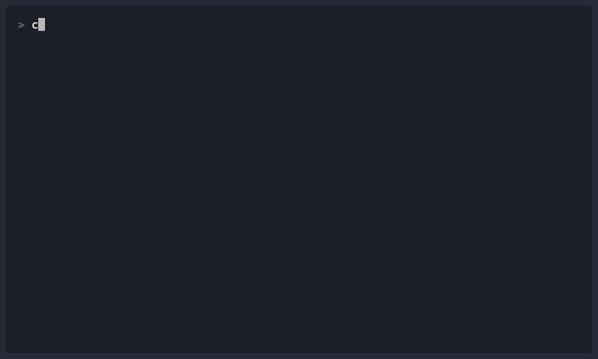

> **Everything you learned combines here. Go from idea to merged PR in a single session.**

In this chapter, you'll bring together everything you've learned into complete workflows. You'll build features using multi-agent collaboration, set up pre-commit hooks that catch security issues before they're committed, integrate Copilot into CI/CD pipelines, and go from feature idea to merged PR in a single terminal session. This is where Copilot CLI becomes a genuine force multiplier.

> ⚠️ **Prerequisites**: This chapter assumes you've completed or are familiar with:
> - **[Chapter 04: Agents](../04-agents-custom-instructions/README.md)** - Creating custom agents like `frontend` and `backend`
> - **[Chapter 05: Skills](../05-skills/README.md)** - Creating skills like `generate-tests`
> - **[Chapter 06: MCP Servers](../06-mcp-servers/README.md)** - Configuring GitHub MCP for PR creation
>
> **Don't have agents/skills set up yet?** No problem! See the "Minimal Workflow" section below that uses only built-in features.

## Learning Objectives

By the end of this chapter, you'll be able to:

- Combine agents, skills, and MCP in unified workflows
- Build complete features using multi-tool approaches
- Set up basic automation with hooks
- Apply best practices for professional development

---

## Idea to Merged PR in One Session

This is the culmination of everything you've learned. Traditional development of a feature like "user favorites" takes 1-2 days. Watch what happens when you combine all your tools:

```bash
copilot

> I need to add a "favorites" feature for our React + Node.js app.
> Users can add items to favorites, view their list, and remove items.

# Copilot creates high-level plan...

# SWITCH TO BACKEND AGENT
> /agent
# Select "backend"

> Design the favorites API:
> - Database schema
> - REST endpoints
> - Authorization rules

# Backend agent produces:
# - PostgreSQL schema with foreign keys
# - POST/GET/DELETE endpoints
# - JWT ownership validation

# SWITCH TO FRONTEND AGENT
> /agent
# Select "frontend"

> Design React components for favorites:
> - FavoriteButton (toggle on any item)
> - FavoritesList (user's favorites page)
> - FavoritesPage (route component)

# Frontend agent produces:
# - TypeScript components with proper interfaces
# - Optimistic updates for instant feedback
# - Accessibility: keyboard nav, ARIA labels

# IMPLEMENT
> Implement the backend API
> Implement the frontend components

# TEST (using your custom skill from Chapter 05, or just ask naturally)
> Generate comprehensive tests for the favorites feature

# SHIP
> Create a pull request with title "Feature: Add user favorites"
```

<details>
<summary>🎬 See it in action!</summary>



</details>

**Traditional approach**: 1-2 days of context-switching between tools

**The key insight**: You directed specialists like an architect. They handled the details. You handled the vision.

---

## Real-World Analogy: The Orchestra

A symphony orchestra has many sections:
- **Strings** provide the foundation (like your core workflows)
- **Brass** adds power (like agents with specialized expertise)
- **Woodwinds** add color (like skills that extend capabilities)
- **Percussion** keeps rhythm (like MCP connecting to external systems)

Individually, each section sounds limited. Together, conducted well, they create something magnificent.

That's what this chapter teaches: conducting your tools into a unified workflow.


*Like a conductor with an orchestra, you orchestrate agents, skills, and MCP into unified workflows*

---

## The Integration Pattern

Here's the mental model for combining everything:

```
+-------------------------------------------------------------+
|                     YOUR WORKFLOW                            |
+-------------------------------------------------------------+
|                                                              |
|  1. GATHER CONTEXT (MCP)                                     |
|     Get issue details from GitHub                            |
|     Read relevant code files                                 |
|                                                              |
|  2. ANALYZE & PLAN (Agents)                                  |
|     Switch to backend agent for analysis                     |
|     Switch to security agent for review                      |
|                                                              |
|  3. EXECUTE (Skills + Manual)                                |
|     Ask naturally - skills load automatically                |
|     Implement the fix                                        |
|                                                              |
|  4. COMPLETE (MCP)                                           |
|     Create PR via GitHub                                     |
|     Request review                                           |
|                                                              |
+-------------------------------------------------------------+
```

---

## Minimal Workflow (No Custom Setup Required)

**Don't have agents or skills configured?** You can still be highly productive with just the built-in features from Chapters 01-03:

```bash
copilot

# 1. Understand the task
> I need to add input validation to the login form. What's the best approach?

# 2. Review existing code
> @src/components/LoginForm.js What validation does this currently have?

# 3. Plan the implementation
> /plan Add email format validation and password strength checking

# 4. Implement (after reviewing the plan)
> Add email format validation using a regex pattern

# 5. Generate tests
> @src/components/LoginForm.js Generate Jest tests for the validation logic

# 6. Review your changes
> /review

# 7. Generate commit message
copilot -p "Generate commit message for: $(git diff --staged)"
```

**This workflow uses only:**
- Interactive mode (Chapter 01)
- The `@` syntax for context (Chapter 02)
- Built-in `/plan` and `/review` commands (Chapters 01 & 03)
- Programmatic mode for commit messages (Chapter 01)

Once comfortable, explore agents, skills, and MCP for even more power.

---

## Workflow 1: Complete Feature Development

Let's build a "user favorites" feature from start to finish. This example uses React + Node.js/Express, but adapt the prompts to your tech stack.

```bash
copilot

# PHASE 1: Understand requirements
> I'm working on a React + Node.js app. I need to add a "favorites" feature. Users should be able to:
> - Add items to favorites
> - View their favorites list
> - Remove items from favorites

# PHASE 2: Check existing code structure
> List the files in src/components/ and src/api/

# PHASE 3: Get database context
> Show me src/models/User.js

# PHASE 4: Switch to specialized agent for design
> /agent
# Select "frontend" from the list

> Design React components for favorites:
> - FavoriteButton (toggle)
> - FavoritesList (display)
> - FavoritesPage (route)

> /agent
# Select "backend"

> Design API endpoints:
> - POST /api/favorites (add)
> - GET /api/favorites (list)
> - DELETE /api/favorites/:id (remove)

> Design the database schema for favorites

# PHASE 5: Implement
> Implement the FavoriteButton component

> Implement the POST /api/favorites endpoint

# PHASE 6: Test
> Generate comprehensive tests for the favorites feature
# Your test generation skill activates automatically

# PHASE 7: Complete
> Create a pull request with title "Feature: Add user favorites"
```

---

## Workflow 2: Bug Investigation and Fix

Real-world bug fixing with full tool integration:

```bash
copilot

# PHASE 1: Understand the bug from GitHub (MCP provides this)
> Get the details of issue #87

# Learn: "Users report that search returns no results when
# query contains special characters like & or +"

# PHASE 2: Find related code
> Search for "search" in src/api/
> Show me src/api/search.js

# PHASE 3: Get expert analysis
> /agent
# Select "backend"

> Analyze this search endpoint for issues with special character handling

# Agent identifies: Query string not being URL encoded

# PHASE 4: Research best practice
> What are the best practices for JavaScript URL encoding?

# PHASE 5: Fix with agent guidance
> Implement the fix using encodeURIComponent

# PHASE 6: Generate tests
> Generate tests for the search endpoint with special characters
> Include test cases: "test&value", "test+value", "test value"

# PHASE 7: Commit and PR
> Generate a commit message for this fix

> Create a pull request linking to issue #87
```

---

## Workflow 3: Code Review Automation

Set up automated code review on your commits:

```bash

# Create a pre-commit hook
cat > .git/hooks/pre-commit << 'EOF'
#!/bin/bash

# Get staged files (JavaScript/TypeScript only)
STAGED=$(git diff --cached --name-only --diff-filter=ACM | grep -E '\.(js|ts|jsx|tsx)$')

if [ -n "$STAGED" ]; then
  echo "Running Copilot review on staged files..."

  for file in $STAGED; do
    echo "Reviewing $file..."

    # Use timeout to prevent hanging (60 seconds per file)
    REVIEW=$(timeout 60 copilot -p "Quick security review of @$file - critical issues only" 2>/dev/null)

    # Check if timeout occurred
    if [ $? -eq 124 ]; then
      echo "Warning: Review timed out for $file (skipping)"
      continue
    fi

    if echo "$REVIEW" | grep -qi "CRITICAL"; then
      echo "Critical issues found in $file:"
      echo "$REVIEW"
      exit 1
    fi
  done

  echo "Review passed"
fi
EOF

chmod +x .git/hooks/pre-commit
```

Now every commit gets a quick security review:

```bash
git add src/api/users.js
git commit -m "Update user endpoint"

# Output:
# Running Copilot review on staged files...
# Reviewing src/api/users.js...
# Critical issues found in src/api/users.js:
# - Line 23: SQL injection vulnerability
#
# Fix the issue and try again.
```

---

## Workflow 4: Multi-Agent Feature Planning

For complex features, use multiple agents in sequence:

```bash
copilot

> I need to build a real-time notification system for our React + Node.js application

# Get architecture from backend agent
> /agent
# Select "backend"

> Design the notification service architecture:
> - WebSocket connection management
> - Event types and payloads
> - Scaling considerations

# Get UI from frontend agent
> /agent
# Select "frontend"

> Design notification UI components:
> - NotificationBell (header icon with count)
> - NotificationPanel (dropdown list)
> - NotificationItem (individual notification)
> - Toast notifications for real-time alerts

# Get data model
> /agent
# Select "backend"

> Design the database schema:
> - notifications table
> - user_notification_preferences table
> - notification_read_status table

# Synthesize into implementation plan
> Combine these designs into a phased implementation plan with:
> - Execution order
> - Dependencies between components
> - Testing strategy
```

---

## Workflow 5: Onboarding to a New Codebase

When joining a new project:

```bash
copilot

# Understand project structure
> Give me an overview of this project structure

# Understand dependencies
> @package.json What does this project do and what are the main dependencies?

# Understand architecture
> @src/ Explain the high-level architecture of this codebase

# Find the entry point
> Where does the application start? Show me the main entry point.

# Understand key flows
> Walk me through how a user request flows from API to database

# Check for issues to work on
> List open issues labeled "good first issue"
```

---

## Best Practices

### 1. Start with Context Before Analysis

Always gather context before asking for analysis:

```bash
# Good
> Get the details of issue #42
> /agent
# Select backend
> Analyze this issue

# Less effective
> /agent
# Select backend
> Fix login bug
# Agent doesn't have issue context
```

### 2. Use Agents for Analysis, Skills for Execution

```bash
# Agent analyzes
> /agent
# Select security
> Review this authentication code

# Skill executes (automatically triggered by your prompt)
> Generate comprehensive tests for this code
```

### 3. Keep Sessions Focused

```bash
# Good: One feature per session
> /rename favorites-feature
# Work on favorites
> /exit

copilot
> /rename notifications-feature
# Work on notifications
> /exit

# Less effective: Everything in one long session
```

### 4. Create Reusable Workflows

Document your workflows so you can repeat them:

```markdown
## Bug Fix Workflow

1. Get issue details from GitHub
2. Search for related code
3. Switch to backend agent for analysis
4. Implement fix
5. Generate tests (skill auto-triggers)
6. Create PR
```

---

## Bonus: Production Patterns

These patterns are optional but valuable for professional environments.

### PR Description Generator

```bash
# Generate comprehensive PR descriptions
BRANCH=$(git branch --show-current)
COMMITS=$(git log main..$BRANCH --oneline)

copilot -p "Generate a PR description for:
Branch: $BRANCH
Commits:
$COMMITS

Include: Summary, Changes Made, Testing Done, Screenshots Needed"
```

### CI/CD Integration (Advanced - Optional)

> ⚠️ **This section is for teams with existing CI/CD pipelines.** Skip this if you're new to GitHub Actions or CI/CD concepts. The pre-commit hook above is a simpler starting point.

> 💡 **Tip**: Use `--silent` flag in CI/CD to suppress stats and progress output for cleaner logs.

```yaml
# .github/workflows/copilot-review.yml
name: Copilot Review

on:
  pull_request:
    types: [opened, synchronize]

jobs:
  review:
    runs-on: ubuntu-latest
    steps:
      - uses: actions/checkout@v4

      - name: Install Copilot CLI
        run: npm install -g @github/copilot

      - name: Review Changed Files
        env:
          GITHUB_TOKEN: ${{ secrets.GITHUB_TOKEN }}
        run: |
          FILES=$(git diff --name-only origin/main...HEAD | grep -E '\.(js|ts)$')
          for file in $FILES; do
            copilot -p "Security review of @$file" --silent >> review.md
          done

      - name: Post Review Comment
        uses: actions/github-script@v7
        with:
          script: |
            const fs = require('fs');
            const review = fs.readFileSync('review.md', 'utf8');
            github.rest.issues.createComment({
              issue_number: context.issue.number,
              owner: context.repo.owner,
              repo: context.repo.repo,
              body: '## Copilot Review\n\n' + review
            });
```

### Team Configuration

For consistent team usage, create shared configurations:

```json
// .copilot/config.json (shared in repo)
{
  "model": "claude-sonnet-4.5",
  "agents": "./.github/agents/",
  "permissions": {
    "allowedPaths": ["src/**/*", "tests/**/*"],
    "deniedPaths": [".env*", "secrets/**/*"]
  }
}
```

---

## 🎯 Try It Yourself

After completing the demos, try these variations:

1. **End-to-End Challenge**: Pick a small feature (e.g., "add dark mode toggle" or "add user avatar upload"). Use the full workflow:
   - Plan with `/plan`
   - Design with agents
   - Implement
   - Generate tests
   - Create PR

2. **Automation Challenge**: Set up the pre-commit hook from the Code Review Automation workflow. Make a commit with an intentional SQL injection. Does it get blocked?

3. **Your Production Workflow**: Design your own workflow for a common task you do. Write it down as a checklist. What parts could be automated with skills, agents, or hooks?

**Self-Check**: You've completed the course when you can explain to a colleague how agents, skills, and MCP work together - and when to use each.

---

## Assignment

### Main Challenge: End-to-End Feature

Build a complete feature using the integration pattern:

1. Choose a feature to build (or use: "Add a dark mode toggle")
2. Gather context about your codebase
3. Design with agents (frontend and backend)
4. Implement the components
5. Generate tests with a skill
6. Create a PR

Document your workflow as you go.

**Success criteria**: You've completed a feature using at least 2 agents and 1 skill.

### Bonus Challenge: Workflow Automation

1. Create a pre-commit hook that runs Copilot review
2. Set up a custom shell function for your most common workflow
3. Document your workflow in a team-shareable format

---

## Course Complete!

Congratulations! You've learned:

| Chapter | What You Mastered |
|---------|-------------------|
| 00 | Instant value with quick start |
| 01 | Three modes of interaction |
| 02 | Context management with @ syntax |
| 03 | Development workflows |
| 04 | Specialized agents |
| 05 | Extensible skills |
| 06 | External connections with MCP |
| 07 | Unified production workflows |

You're now equipped to use GitHub Copilot CLI as a genuine force multiplier in your development workflow.

---

## What's Next?

Your learning doesn't stop here:

1. **Practice daily**: Use Copilot CLI for real work
2. **Build custom tools**: Create agents and skills for your specific needs
3. **Share knowledge**: Help your team adopt these workflows
4. **Stay updated**: Follow GitHub Copilot updates for new features

### Resources

- [GitHub Copilot CLI Documentation](https://docs.github.com/en/copilot)
- [MCP Server Registry](https://github.com/modelcontextprotocol/servers)
- [Community Skills](https://github.com/topics/copilot-skill)

---

## Key Takeaways

1. **Integration > Isolation**: Combine tools for maximum impact
2. **Context first**: Always gather context before analysis
3. **Agents analyze, Skills execute**: Use the right tool for the job
4. **Automate repetition**: Hooks and scripts multiply your effectiveness
5. **Document workflows**: Shareable patterns benefit the whole team

> 📋 **Quick Reference**: See the [Command Cheat Sheet](../QUICK-REFERENCE.md) for a complete list of commands and shortcuts.

---

**You did it! Now go build something amazing.**

**[← Back to Chapter 06](../06-mcp-servers/README.md)** | **[Return to Course Home →](../README.md)**
